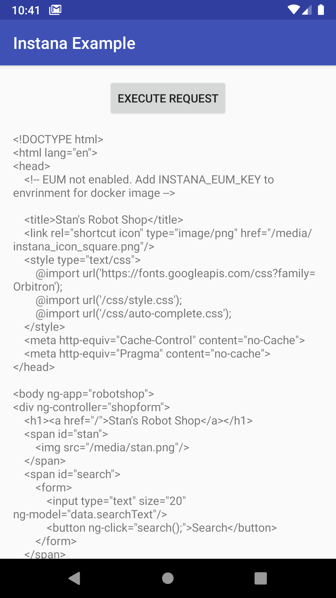

# Kotlin Example for Instana Android Agent

This app showcases the simplest use case of the Instana Android Agent in an Android app written using:
- Kotlin
- Coroutines
- OkHttp3

## Compiling

Open [ExampleApp.kt](app/src/main/java/com/instana/android/example/ExampleApp.kt) and replace these two values with your own (obtained in your Instana Dashboard): 
1. `REPORTING_URL`
2. `KEY`

Compile as usual using Android Studio 3.x

## Structure

- Instana dependencies in [project-level gradle.build](build.gradle)
- Instana plugin and dependencies in [module-level gradle.build](app/build.gradle)
- Minimal initialization of Instana Agent in [ExampleApp.kt](app/src/main/java/com/instana/android/example/ExampleApp.kt)
- Set view name in `onResume()` in [MainActivity.kt](app/src/main/java/com/instana/android/example/MainActivity.kt)
- OkHttp3 and coroutines to execute a single query which Instana automatically tracks
